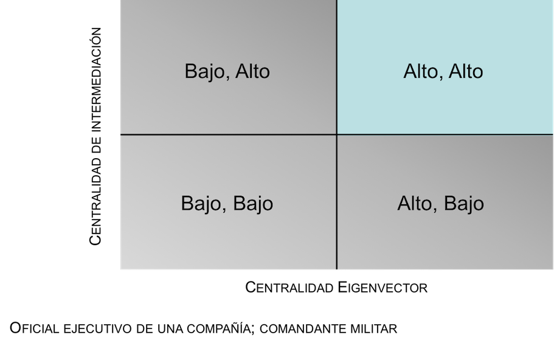
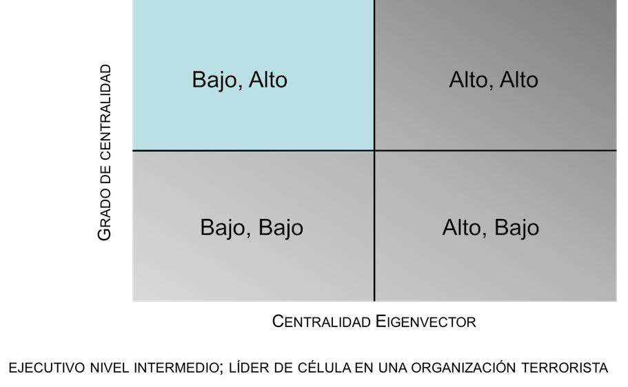
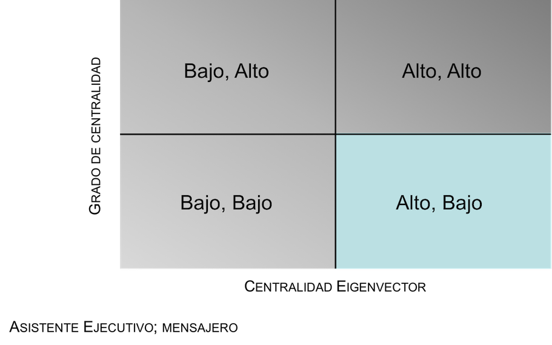

```{r setup, include=FALSE}
knitr::opts_chunk$set(echo = FALSE)
rm(list = ls())
```

##Introducion
<br>
¿Que es la centralidad?

  - El enfoque en los actores de la red. 
<center>  
```{r,  warning=F, message=F}
Communication <- as.matrix(read.csv(file="Communication.csv", header=T, row.names=1))
Kinship <- as.matrix(read.csv(file="Kinship.csv", header=T, row.names=1))
nl1 <- read.csv(file="NodeAttributes.csv", header=T, as.is=T)
library(igraph)
comm_g <-graph.adjacency(Communication)
comm_df <- get.data.frame(comm_g)
comm_df$rel <- "Communication"
kin_g <-graph.adjacency(Kinship)
kin_df <- get.data.frame(kin_g)
kin_df$rel <- "Kinship"
el1 <- rbind(comm_df, kin_df)
g1 <- graph_from_edgelist(as.matrix(el1[1:2]), directed = FALSE)
metrics=data.frame(id = V(g1)$name,
               Degree = degree(g1,
              mode="total",
              loops=FALSE,
              normalized = FALSE),
              InDegree = degree(g1,
              mode="in",
              loops=FALSE,
              normalized = FALSE),
              OutDegree = degree(g1,
              mode="out",
              loops=FALSE,
              normalized = FALSE),
              Betweenness = round(betweenness(g1,
                                        directed = F,
                                        weights = NULL,
                                        normalized = T),
                                  digits = 3),
              Eigenvector = eigen_centrality(g1,
                                             directed=F,
                                             weights = NULL),
              Closeness = round(closeness(g1,
                                    mode="total",
                                    weights = NULL,
                                    normalized=T),
                                digits = 3))
library(visNetwork)
nl1$title <- nl1$Name
nl1 <- merge(nl1, metrics, by="id")
visNetwork(nodes=nl1, edges = el1, width = "100%", height = "525px")%>%
  visOptions(highlightNearest =  TRUE) %>%
  visIgraphLayout(layout = "layout_nicely") %>%
  visInteraction(navigationButtons =T)
```
</center>

##Grado de centralidad

  - Grado de Centralidad: el conteo del número de vínculos de un actor (relaciones).
  - Las personas u organizaciones que están "al tanto" son los que están vinculados a muchas otras y por lo tanto, en virtud de su posición tienen acceso a las ideas, pensamientos, y creencias de muchos otros
  - Pero...

##Grado de centralidad
<center>
```{r}
library(scales)
nl1$label <- ""
nl1$size <- rescale(nl1$Degree, to=c(10,50))
visNetwork(nodes=nl1, edges = el1, width = "100%", height = "700px")%>%
  visOptions(highlightNearest =  TRUE) %>%
  visIgraphLayout(layout = "layout_nicely") %>%
  visInteraction(navigationButtons =T)
```
</center>

##Centralidad de Cercanía

  - Centralidad de Cercanía: mide que tan cercano (promedio) es cada actor a los demás actores en una red
  - La cercanía pone de manifiesto el tiempo que tarda información en transmitirse de una persona a los demás en la red. Personas de alta calificación tienen caminos más cortos a todos los demás en la red 
  - Pero...

##Centralidad de Cercanía
<center>
```{r}
library(scales)
nl1$label <- ""
nl1$title <- paste0("<b>Name:</b>", nl1$Name,"<br>",
                    "<b>Closeness Cetrality:</b>", round(nl1$Closeness, 2))
nl1$size <- rescale(nl1$Closeness, to=c(10,50))
visNetwork(nodes=nl1, edges = el1, width = "100%", height = "700px")%>%
  visOptions(highlightNearest =  TRUE) %>%
  visIgraphLayout(layout = "layout_nicely") %>%
  visInteraction(navigationButtons =T)
```
</center>

##Centralidad de Intermediacion

  - Centralidad de Intermediacion: mide el alcance en que cada actor se encuentra con relación al vínculo mas corto entre todos los actores de una red
  - Las personas u organizaciones que son potencialmente influyentes están en condiciones de establecer conexiones entre los grupos y para imponer influencia sobre un grupo o otro, o actuar como un portero entre los grupos. Este agente ocurre en muchos de los caminos más cortos entre otros agentes
  - Pero...

##Centralidad de Intermediacion
<center>
```{r}
library(scales)
nl1$label <- ""
nl1$title <- paste0("<b>Name:</b>", nl1$Name,"<br>",
                    "<b>Closeness Intermediacion:</b>", round(nl1$Betweenness, 2))
nl1$size <- rescale(nl1$Betweenness, to=c(10,50))
visNetwork(nodes=nl1, edges = el1, width = "100%", height = "700px")%>%
  visOptions(highlightNearest =  TRUE) %>%
  visIgraphLayout(layout = "layout_nicely") %>%
  visInteraction(navigationButtons =T)
```
</center>

##Centralidad de Eigenvector

  - Centralidad de Eigenvector: asume que vínculos hacia actores mas centrales son mas importantes que vínculos hacia actores periféricos. Por lo tanto, la centralidad Eigenvector de un actor es la suma de sus conexiones con otros, medido por resultados de centralidad
  - Se deduce que una persona bien conectada con buenas conexiones puede propagar información mucho más rápidamente que uno que sólo tiene conexiones con personas menos importantes en una red. Las personas con puntuaciones más altas puede ser crucial cuando la comunicación rápida es necesaria
  - Pero...

##Centralidad de Eigenvector
<center>
```{r}
library(scales)
nl1$label <- ""
nl1$title <- paste0("<b>Name:</b>", nl1$Name,"<br>",
                    "<b>Closeness Eigenvector:</b>",
                    round(nl1$Eigenvector.vector, 2))
nl1$size <- rescale(nl1$Eigenvector.vector, to=c(10,50))
visNetwork(nodes=nl1, edges = el1, width = "100%", height = "700px")%>%
  visOptions(highlightNearest =  TRUE) %>%
  visIgraphLayout(layout = "layout_nicely") %>%
  visInteraction(navigationButtons =T)
```
</center>

##
<center>
<div class="midcenter" style="margin-top:250px;background-color:transparent">
Centralidad, Poder y Prestigio
<br>
<b>Combinaciones</b>
</div>
</center>

##Lideres de Alto Nivel
<center>
<div class="midcenter" style="margin-left:0px; margin-top:110px;background-color:transparent">
</img>
</div>
</center>

##Lideres de Alto Nivel
<br><br>
<center>
```{r}
el2 <- data.frame(from=c("a","a","a","a","a","a","a","a",
                            "b","b","b","c","d",
                         "g","g","g","f","h",
                         "k","k","k","m"),
                     to=c("b","c","f","g","m","l","k","j",
                          "c","d","e","e","e",
                          "f","h","i","h","i",
                          "m","l","j","l")
                     )
g2 <- graph_from_edgelist(as.matrix(el2), directed = F)
metrics2=data.frame(name = V(g2)$name,
               Degree = degree(g2,
              mode="total",
              loops=FALSE,
              normalized = FALSE),
              Betweenness = round(betweenness(g2,
                                        directed = F,
                                        weights = NULL,
                                        normalized = T),
                                  digits = 2),
              Eigenvector = eigen_centrality(g2,
                                             directed=F,
                                             weights = NULL),
              Closeness = round(closeness(g2,
                                    mode="total",
                                    weights = NULL,
                                    normalized=T),
                                digits = 2))
nl2 <- get.vertex.attribute(g2)
nl2 <- merge(nl2, metrics2, by="name")
nl2$id<-nl2$name
nl2$label <- nl2$name
nl2$title <- paste("<b> Betweenness:</b>", round(nl2$Betweenness, 2),"<br>",
                   "<b> Eigenvector:</b>", round(nl2$Eigenvector.vector, 2))
visNetwork(nodes=nl2, edges = el2, width = "100%", height = "525px")%>%
  visOptions(highlightNearest =  TRUE) %>%
  visIgraphLayout(layout = "layout_nicely") %>%
  visInteraction(navigationButtons =T)
```
</center>

##Lideres Emergentes
<center>
<div class="midcenter" style="margin-left:0px; margin-top:110px;background-color:transparent">
</img>
</div>
</center>

##Lideres Emergentes
<br><br>
<center>
```{r}
nl2$title <- paste("<b> Eigenvector:</b>", round(nl2$Eigenvector.vector, 2),"<br>",
                   "<b> Degree:</b>", round(nl2$Degree, 2))
visNetwork(nodes=nl2, edges = el2, width = "100%", height = "525px")%>%
  visOptions(highlightNearest =  TRUE) %>%
  visIgraphLayout(layout = "layout_nicely") %>%
  visInteraction(navigationButtons =T)
```
</center>

##Porteros
<center>
<div class="midcenter" style="margin-left:0px; margin-top:110px;background-color:transparent">
</img>
</div>
</center>

##Porteros
<br><br>
<center>
```{r}
el3 <- data.frame(from=c("a","a","a","b","c","c","c","g","g","g"),
                  to=c("b","c","g","d","d","e","f","h","i","j"))

g3 <- graph_from_edgelist(as.matrix(el3), directed = F)
metrics3=data.frame(name = V(g3)$name,
               Degree = degree(g3,
              mode="total",
              loops=FALSE,
              normalized = FALSE),
              Betweenness = round(betweenness(g3,
                                        directed = F,
                                        weights = NULL,
                                        normalized = T),
                                  digits = 2),
              Eigenvector = eigen_centrality(g3,
                                             directed=F,
                                             weights = NULL),
              Closeness = round(closeness(g3,
                                    mode="total",
                                    weights = NULL,
                                    normalized=T),
                                digits = 2))
nl3 <- get.vertex.attribute(g3)
nl3 <- merge(nl3, metrics3, by="name")
nl3$id<-nl3$name
nl3$label <- nl3$name
nl3$title <- paste("<b> Eigenvector:</b>", round(nl3$Eigenvector.vector, 2),"<br>",
                   "<b> Degree:</b>", round(nl3$Degree, 2))
visNetwork(nodes=nl3, edges = el3, width = "100%", height = "525px")%>%
  visOptions(highlightNearest =  TRUE) %>%
  visIgraphLayout(layout = "layout_nicely") %>%
  visInteraction(navigationButtons =T)
```
</center>

## Quienes Traspasan Los Límites (Potencialmente)
<center>
<div class="midcenter" style="margin-left:0px; margin-top:110px;background-color:transparent">
</img>
</div>
</center>

## Quienes Traspasan Los Límites (Potencialmente)
<br><br>
<center>
```{r}
el4 <- data.frame(from=c("a","a","b","b","b","d","d","e","c","c","c","g","g","h","j","j"),
                  to=c("b","c","d","e","f","e","f","f","i","h","g","i","h","i","i","h"))

g4 <- graph_from_edgelist(as.matrix(el4), directed = F)
metrics4=data.frame(name = V(g4)$name,
               Degree = degree(g4,
              mode="total",
              loops=FALSE,
              normalized = FALSE),
              Betweenness = round(betweenness(g4,
                                        directed = F,
                                        weights = NULL,
                                        normalized = T),
                                  digits = 2),
              Eigenvector = eigen_centrality(g4,
                                             directed=F,
                                             weights = NULL),
              Closeness = round(closeness(g4,
                                    mode="total",
                                    weights = NULL,
                                    normalized=T),
                                digits = 2))
nl4 <- get.vertex.attribute(g4)
nl4 <- merge(nl4, metrics4, by="name")
nl4$id<-nl4$name
nl4$label <- nl4$name
nl4$title <- paste("<b> Betweenness:</b>", round(nl4$Betweenness, 2),"<br>",
                   "<b> Degree:</b>", round(nl4$Degree, 2))
visNetwork(nodes=nl4, edges = el4, width = "100%", height = "525px")%>%
  visOptions(highlightNearest =  TRUE) %>%
  visIgraphLayout(layout = "layout_nicely") %>%
  visInteraction(navigationButtons =T)
```
</center>

##
<center>
<div class="midcenter" style="margin-top:250px;background-color:transparent">
Centralidad y Prestigio
<br>
<b>Datos Dirigidos</b>
</div>
</center>

## Centralidad Grado de Llegada

  - En las redes dirigidas, personas que reciben muchas opciones positivas son generalmente considerados por analistas de redes, socialmente prestigiosos
  
    - Se hace especialmente relevante si elecciones positivas no son recíprocas.
    - Por ejemplo, si todo el mundo le gusta jugar con la chica o chico mas popular de un grupo, pero ella o él no juegan con todos ellos.
    - Datos Krackhardt: personas que se buscan consejos.

##¿A quien le pides consejos?
<br><br>
<center>
```{r,  warning=F, message=F}
library(NetData)
data(kracknets)
non_zero_advice <- subset(advice_data_frame, advice_tie == 1)
g_advice <- graph_from_edgelist(as.matrix(non_zero_advice[1:2]), directed=T)
V(g_advice)$id <- as.factor(1:21)
V(g_advice)$In <- degree(g_advice, mode="in")
V(g_advice)$Out <- degree(g_advice, mode="out")
el5 <- non_zero_advice[1:2]
colnames(el5) <- c("from","to")

nl5 <- as.data.frame(get.vertex.attribute(g_advice))
nl5$title <- paste("<b> In Degree:</b>", round(nl5$In, 2))
nl5$id <- as.integer(nl5$id)
el5$from <- as.integer(el5$from)
el5$to <- as.integer(el5$to)
el5$arrows <- "to"
nl5$size <- rescale(nl5$In, to=c(10,50))
visNetwork(nodes=nl5, edges = el5, width = "100%", height = "525px")%>%
  visOptions(highlightNearest =  TRUE) %>%
  visIgraphLayout(layout = "layout_nicely") %>%
  visInteraction(navigationButtons =T)
```
</center>

## Centralidad de Grado de Entrada
<center>
<div class="midcenter" style="margin-top:250px;background-color:transparent">
<br>
Depende del contexto...
</div>
</center>

##¿A quien le das consejos?
<br><br>
<center>
```{r,  warning=F, message=F}
nl5$title <- paste("<b> Out Degree:</b>", round(nl5$Out, 2))
nl5$size <- rescale(nl5$Out, to=c(10,50))
visNetwork(nodes=nl5, edges = el5, width = "100%", height = "525px")%>%
  visOptions(highlightNearest =  TRUE) %>%
  visIgraphLayout(layout = "layout_nicely") %>%
  visInteraction(navigationButtons =T)
```
</center>

##
<center>
<div class="midcenter" style="margin-top:250px;background-color:transparent">
<br>
<b>¿Preguntas?</b>
</div>
</center>