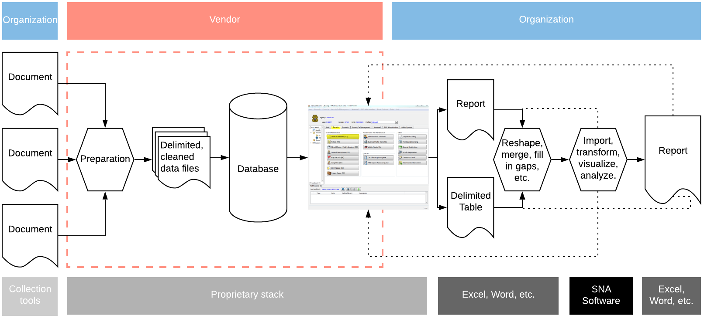

```{r setup, include=FALSE}
knitr::opts_chunk$set(echo      = FALSE,
                      eval      = TRUE,
                      warning   = FALSE,
                      message   = FALSE,
                      fig.align = "center",
                      comment   = '')

library(xaringanthemer)
style_mono_light(
  title_slide_background_color = "#23395b",
  code_font_family = "Fira Code",
  code_font_url    = "https://cdn.rawgit.com/tonsky/FiraCode/1.204/distr/fira_code.css",
  code_font_size   = ".65em",
  text_font_google = google_font("Work Sans", "300", "300i"),
  text_font_size   = "25px",
  background_size  = "20%", 
  background_posit = "bottom",
  padding          = "1em 4em 1em 4em",
  header_h1_font_size = "2.25rem",
  header_h2_font_size = "2.0rem",
  header_h3_font_size = "1.75rem",
  colors = c(
  red = "#f34213",
  purple = "#3e2f5b")
)

here::set_here()

library(igraph)
library(dplyr)
```

#  Datos: Modo dos

Datos relacionales de **modo-dos**:
  - Consiste en dos grupos de actores `r emo::ji("smile")` <-> `r emo::ji("house")`
  - Persona a organización (`r emo::ji("actor")` <-> `r emo::ji("house")`), persona a evento (`r emo::ji("actor")` <-> `r emo::ji("time")`), persona a prueba (`r emo::ji("actor")` <-> `r emo::ji("graph")`), persona a ubicación `r emo::ji("actor")` <-> `r emo::ji("flag")`
  - Una red de modo-dos se puede transformar en una red de modo-uno

---

# Ejemplo

```{r}
g <- bipartite.random.game(n1 = 4, n2 = 8, p = 0.5) 
g %>%
  plot.igraph(
    vertex.color = ifelse(
                    get.vertex.attribute(., "type") == TRUE,
                    "black",
                    "grey"),
    vertex.shape = ifelse(
                    get.vertex.attribute(., "type") == TRUE,
                    "circle",
                    "square"),
    vertex.border.color = "black",
    layout = layout_with_kk,
    vertex.label.color = "white",
    edge.color = "grey"
  )
```


---

# Ejemplo

<br/><br/>
.center[
```{r}
g %>%
  get.incidence()
```
]


---

# Ejemplo

```{r}
g %>%
  plot.igraph(
    vertex.color = ifelse(
                    get.vertex.attribute(., "type") == TRUE,
                    "black",
                    "grey"),
    vertex.shape = ifelse(
                    get.vertex.attribute(., "type") == TRUE,
                    "circle",
                    "square"),
    vertex.border.color = "black",
    layout = layout_as_bipartite,
    vertex.label.color = "white",
    edge.color = "grey"
  )
```


---

# Ejemplo

<br/>

```{r}
g %>%
  get.adjacency(sparse = FALSE) 
```


---

# Ejemplo

.center[
```{r}
g %>%
  get.data.frame("edges") %>%
  DT::datatable(class = 'cell-border stripe',
                rownames = FALSE,
                options = list(dom      = 't',
                               scroller = TRUE,
                               scrollY  = 400))
```
]


---

# Datos de modo dos

Está interesado en examinar la siguiente red de __personas__:
  - Juan es miembro de la organización 1 (O1) y la organización 3 (O3).
  - Martina es miembro de la organización 1 (O1), organización 5 (O5), y la organización 3 (O3).
  - José asiste a las reuniones de la organización 1 (O1) y es el tesorero de la organización 3 (O3).
  - María participa en la organización 3 (O3), la organización 4 (O4) y (O6).
  - Eric solo está asociado con la organización 6 (O6).
  - Se sabe que Augusto es miembro de la organización 5 (O5) y de la organización 8 (O8).
  - Se sabe que Daniel participa en reuniones para la organización 8 (O8).

---

# Datos de modo dos: Grabación

```{r}
bip <- data.frame(from = c("Juan", "Juan",
                           "Martina", "Martina", "Martina", 
                           "Jose", "Jose",
                           "Maria", "Maria", "Maria",
                           "Eric",
                           "Augusto", "Augusto",
                           "Daniel"),
                 to   = c("O1", "O2",
                          "O1", "O3", "O5",
                          "O1", "O3",
                          "O3", "O4", "O6",
                          "O6",
                          "O5", "O8",
                          "O8")) %>%
  graph_from_data_frame(directed = FALSE) %>%
  set_vertex_attr(.,
                  name  = "type",
                  value = bipartite.mapping(.)$type)
bip %>%
  get.data.frame("edges") %>%
  DT::datatable(class = 'cell-border stripe',
                rownames = FALSE,
                options = list(dom      = 't',
                               scroller = TRUE,
                               scrollY  = 400))
```


---

# Red Modo Dos

```{r}
bip %>%
  set_vertex_attr(name  = "type",
                  value = bipartite_mapping(.)$type) %>%
  set_vertex_attr(name  = "shape",
                  value = ifelse(V(.)$type == FALSE, "circle", "square")) %>%
  set_vertex_attr(name  = "color",
                  value = ifelse(V(.)$type == FALSE, "lightblue", "salmon")) %>%
  plot(
    layout           = layout_as_bipartite,
    verter.label.cex = 0.5
  )
```


---

</br></br>
.center[
#Plegado
]


---

</br></br>
.center[
**¿Qué personas se encuentran en el centro de la red? ¿Cuáles se encuentran el a periferia?**
]


---

# Plegado: persona a persona

```{r}
bip %>%
  set_vertex_attr(name  = "type",
                  value = bipartite_mapping(.)$type) %>%
  bipartite.projection(which = "false") %>%
  plot(
    layout           = layout_with_kk,
    verter.label.cex = 0.5,
    vertex.shape     = "circle",
    vertex.color     = "lightblue"
  )
```


---

</br></br>
.center[
**¿Qué organizaciones se encuentran en el centro de la red? ¿Cuáles se encuentran el a periferia?**
]


---

# Plegado: organización a organización

```{r}
bip %>%
  set_vertex_attr(name  = "type",
                  value = bipartite_mapping(.)$type) %>%
  bipartite.projection(which = "true") %>%
  plot(
    layout           = layout_with_kk,
    vertex.label.cex = 0.5,
    vertex.shape     = "square",
    vertex.color     = "salmon"
  )
```


---

</br></br>
.center[
**¿Qué persona(s) es(son) importante?**

<br>

.small[
¿Qué es "importante"?
]
]

---

# Plegado: ¿Quién es importante?


</br>

.center[

```{r}
bip %>%
  set_vertex_attr(name  = "type",
                  value = bipartite_mapping(.)$type) %>%
  bipartite.projection(which = "false") %>% 
  get.adjacency(sparse = FALSE) %>%
  rbind(., colSums(.)) %>%
  cbind(., rowSums(.))
```

]

---

</br></br>
.center[
**¿Qué organización(es) es(son) importante?**

<br>

.small[
¿Qué es "importante"?
]
]


---

# Plegado: ¿Quién es importante?


</br>

.center[

```{r}
bip %>%
  set_vertex_attr(name  = "type",
                  value = bipartite_mapping(.)$type) %>%
  bipartite.projection(which = "true") %>% 
  get.adjacency(sparse = FALSE) %>%
  rbind(., colSums(.)) %>%
  cbind(., rowSums(.))
```

]


---

</br></br>
.center[
#Ahora nosotros
]


---

# Probando, probando, probando

</br>

```{r, echo = FALSE, fig.align = 'center'}
knitr::include_graphics(path = "imgs/gephi.png")
```


---

</br></br>
.center[
#Ejemplo Practico
]

```{r, echo = FALSE}
library(RSQLite)
con <- dbConnect(SQLite(), "my-db.sqlite")
```


---

<br/>




---

# Ejemplo

</br>

```{r}
knitr::include_graphics(path = "imgs/fcc.png")
```

---

# Conoce nuestra base de datos

.pull-left[

]
.pull-right[
Ejemplo de base de datos portátil (SQLite) con tres tablas:
  
  * `criminal_events`
  * `person_info`
  * `person_x_events`
]

</hr>

__NOTA: Los datos presentados a continuación no son datos LE reales, solo datos ficticios destinados a imitar los reales.__

</hr></br>


---

# `person_info`

```{r, echo = FALSE}
tbl(con, "person_info") %>%
  collect() %>%
  DT::datatable(class = 'cell-border stripe',
                rownames = FALSE,
                options = list(dom = 't',
                               scrollY = 300,
                               # scrollX = "100%",
                               scrollX = TRUE,
                               scroller = TRUE))
```


---

# `person_x_events`

```{r, echo = FALSE}
tbl(con, "person_x_events") %>%
  collect() %>%
  DT::datatable(class = 'cell-border stripe',
                rownames = FALSE,
                options = list(dom = 't',
                               scrollY = 300,
                               # scrollX = "100%",
                               scrollX = TRUE,
                               scroller = TRUE))
```


---

# `criminal_events`

```{r, echo = FALSE}
tbl(con, "criminal_events") %>%
  collect() %>%
  DT::datatable(class = 'cell-border stripe',
                rownames = FALSE,
                options = list(dom = 't',
                               scrollY = 300,
                               # scrollX = "100%",
                               scrollX = TRUE,
                               scroller = TRUE))
```


---

# Creación de datos de red

.pull-left[
### Requisitos

  * Lista de aristas
  * Lista de nodos

### El reto

  * Aristas en tabla: `person_x_events`
  * <font color="red"> Persona </font> atributos en la tabla `person_info`
  * <font color="blue"> Evento </font> atributos en la tabla `criminal_events`
]

.pull-right[
```{r, echo = FALSE}
library(igraph)
bip_g <- igraph::sample_bipartite(5, 10, p = 0.5)
igraph::plot.igraph(bip_g,
                    layout       = layout_as_bipartite,
                    vertex.color = if_else(V(bip_g)$type == FALSE,
                                           "red",
                                           "blue"),
                    vertex.label = NA
                    )
```
]


---

# Generar una lista de bordes

.pull-left[
```{sql, eval = FALSE, echo = TRUE}
SELECT *
FROM `person_x_events`
```
]

.pull-right[

* ¿Cómo puedo refinar mi consulta?
* ¿Qué deberíamos devolver para ARSo?

]

```{r, echo = FALSE}
tbl(con, "person_x_events") %>%
  collect() %>%
  DT::datatable(class = 'cell-border stripe',
                rownames = FALSE,
                options = list(dom = 't',
                               scrollY = 200,
                               # scrollX = "100%",
                               scrollX = TRUE,
                               scroller = TRUE))
```
 

---

# Filtrado de observaciones

```{sql, eval = FALSE, echo = TRUE}
SELECT *
FROM `person_x_events`
WHERE (`Beat` = 2232.0 AND `FBI.Code` = '15')
```

```{r, echo = FALSE}
tbl(con, "person_x_events") %>%
  filter(Beat == 2232 & FBI.Code == "15") %>%
  collect() %>%
  DT::datatable(class = 'cell-border stripe',
                rownames = FALSE,
                options = list(dom = 't',
                               scrollY = 200,
                               # scrollX = "100%",
                               scrollX = TRUE,
                               scroller = TRUE))
```


---

# Seleccionar variables

```{sql, eval = FALSE, echo = TRUE}
SELECT `PID` AS `Source`, `eventId` AS `Target`, `UpdateDate`
FROM `person_x_events`
WHERE (`Beat` = 2232.0 AND `FBI.Code` = '15')
```

```{r, echo = FALSE}
tbl(con, "person_x_events") %>%
  filter(Beat == 2232 & FBI.Code == "15") %>%
  select(Source = PID, Target = eventId, UpdateDate) %>%
  collect() %>%
  DT::datatable(class = 'cell-border stripe',
                rownames = FALSE,
                options = list(dom = 't',
                               scrollY = 200,
                               # scrollX = "100%",
                               scrollX = TRUE,
                               scroller = TRUE))
```


---

# Agregar variables

```{sql, eval = FALSE, echo = TRUE}
SELECT `PID` AS `Source`, `eventId` AS `Target`, 'Person' AS `Source_class`,
'Event' AS `Target_class`, `UpdateDate`
FROM `person_x_events`
WHERE (`Beat` = 2232.0 AND `FBI.Code` = '15')
```

```{r, echo = FALSE}
tbl(con, "person_x_events") %>%
  filter(Beat == 2232 & FBI.Code == "15") %>%
  mutate(Source_class = "Person", Target_class = "Event") %>%
  select(Source = PID, Target = eventId, Source_class, Target_class, UpdateDate) %>%
  collect() %>%
  DT::datatable(class = 'cell-border stripe',
                rownames = FALSE,
                options = list(dom = 't',
                               scrollY = 170,
                               # scrollX = "100%",
                               scrollX = TRUE,
                               scroller = TRUE))
```


---

# Probando, probando, probando

</br>

```{r, echo = FALSE, fig.align = 'center'}
knitr::include_graphics(path = "imgs/gephi.png")
```


---

# Modo dos a modo uno

```{r, echo = FALSE}
tbl(con, "person_x_events") %>%
  filter(Beat == 2232 & FBI.Code == "15") %>%
  select(eventId, PID, UpdateDate) %>%
  inner_join(., 
             select(., eventId, PID2 = PID)) %>%
  select(Source = PID, Target = PID2, everything()) %>%
  filter(Source != Target) %>%
  collect() %>%
  DT::datatable(class = 'cell-border stripe',
                rownames = FALSE,
                options = list(dom = 't',
                               scrollY = 200,
                               # scrollX = "100%",
                               scrollX = TRUE,
                               scroller = TRUE))
```


---

# Codigo en SQL

.sql-collapse-code[
```{sql, eval = FALSE, echo = TRUE}
SELECT *
FROM (SELECT `PID` AS `Source`, 'Person' AS `Source_Type`, `PID2` AS `Target`, 'Person' AS `Target_Type`, 'Co-Event' AS `Relationship`, `eventId`, `UpdateDate` FROM (SELECT `LHS`.`eventId` AS `eventId`, `LHS`.`PID` AS `PID`, `LHS`.`UpdateDate` AS `UpdateDate`, `RHS`.`PID2` AS `PID2` FROM (SELECT `eventId`, `PID`, `UpdateDate` FROM `person_x_events`
WHERE (`Beat` = 2232.0 AND `FBI.Code` = '15')) AS `LHS`
INNER JOIN (SELECT `eventId`, `PID` AS `PID2` FROM `person_x_events`
WHERE (`Beat` = 2232.0 AND `FBI.Code` = '15')) AS `RHS`
ON (`LHS`.`eventId` = `RHS`.`eventId`)))
WHERE (`Source` != `Target`)
```
]

---

# Generando una lista de nodos

```{sql, eval = FALSE, echo = TRUE}
SELECT *
FROM person_info
WHERE PID IN (SELECT `PID`
              FROM person_x_events
              WHERE (`Beat` = 2232.0 AND `FBI.Code` = '15'))
```

```{r, echo = FALSE}
tbl(con, sql(
  "
  SELECT *
  FROM person_info
  WHERE PID IN (SELECT `PID`
                FROM person_x_events
                WHERE (`Beat` = 2232.0 AND `FBI.Code` = '15'))
  ")) %>%
  collect() %>%
  DT::datatable(class = 'cell-border stripe',
                rownames = FALSE,
                options = list(dom = 't',
                               scrollY = 110,
                               # scrollX = "100%",
                               scrollX = TRUE,
                               scroller = TRUE))
```


---

# Probando, probando, probando

</br>

```{r, echo = FALSE, fig.align = 'center'}
knitr::include_graphics(path = "imgs/gephi.png")
```


---
<br>
.center[
### ¿Preguntas?
]

