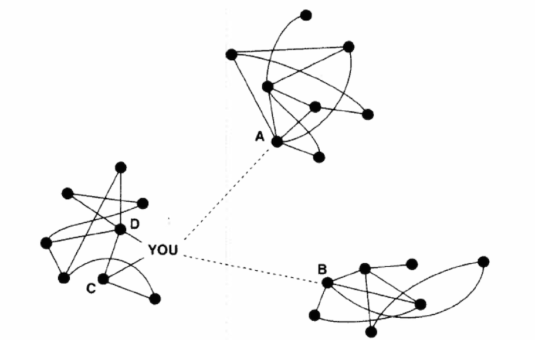
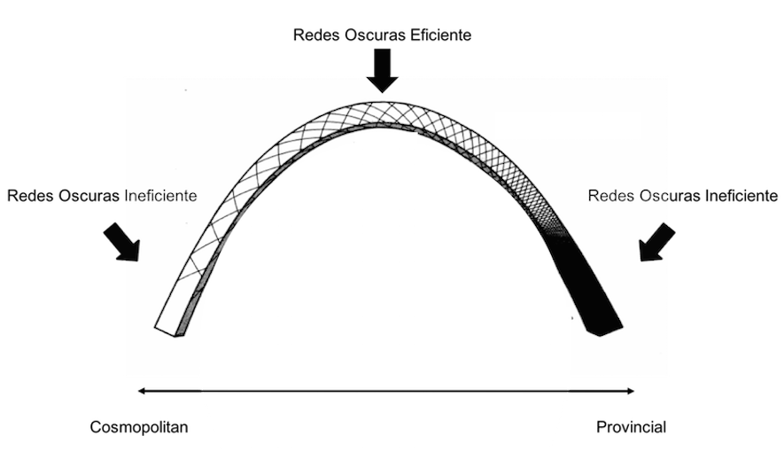
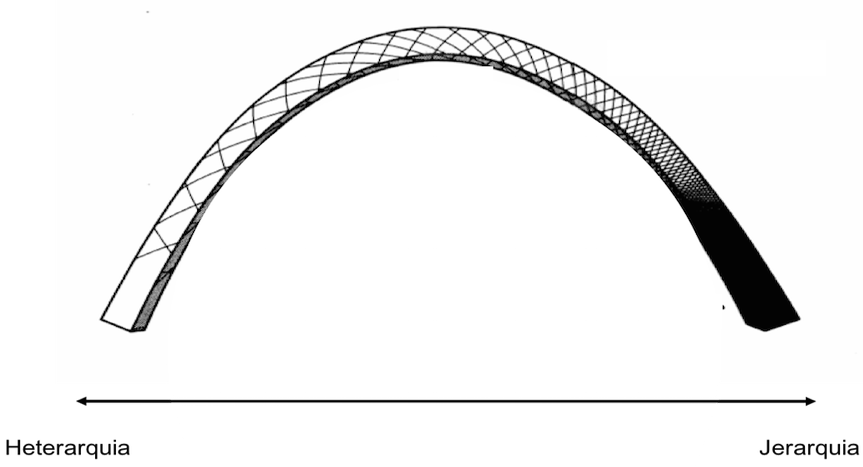
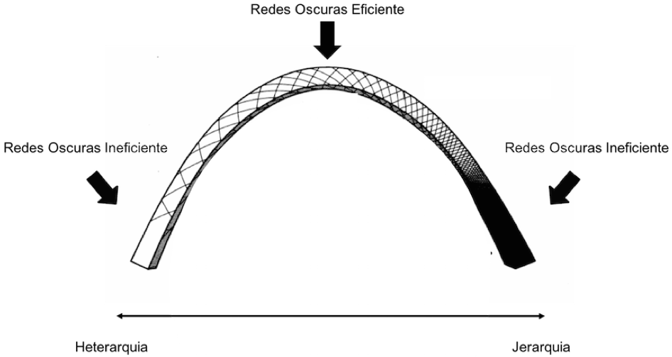
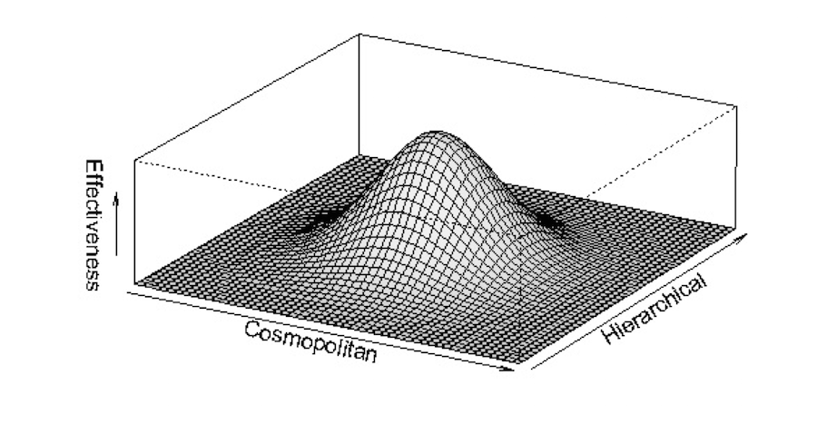

```{r setup, include=FALSE}
knitr::opts_chunk$set(echo      = FALSE,
                      eval      = TRUE,
                      warning   = FALSE,
                      message   = FALSE,
                      fig.align = "center",
                      comment   = '')

library(xaringanthemer)
style_mono_light(
  title_slide_background_color = "#23395b",
  code_font_family = "Fira Code",
  code_font_url    = "https://cdn.rawgit.com/tonsky/FiraCode/1.204/distr/fira_code.css",
  code_font_size   = ".65em",
  text_font_google = google_font("Work Sans", "300", "300i"),
  text_font_size   = "25px",
  background_size  = "20%", 
  background_posit = "bottom",
  padding          = "1em 4em 1em 4em",
  header_h1_font_size = "2.25rem",
  header_h2_font_size = "2.0rem",
  header_h3_font_size = "1.75rem",
  colors = c(
  red = "#f34213",
  purple = "#3e2f5b")
)

library(igraph)
library(dplyr)
```

# Introdución

<br>
¿Que es la topología?

  - Un enfoque en la estructura de la red
  
¿Por que utilizamos esta familia de medidas?

  - Resiliencia vs. efectividad
  - Importante antes de la centralidad

---

# Ejemplo #1

```{r, fig.height = 6}
el1 <- data.frame(from=c(1,1,1,1),to=c(2,3,4,5))
nl1 <- data.frame(id=1:5, label=1:5)
igraph::graph_from_data_frame(d        = el1,
                              directed = FALSE,
                              vertices = nl1) %>%
  plot.igraph(
    vertex.color = "black",
    vertex.label.color = "white",
    vertex.size = 15
  )
```

---

# Ejemplo #2

```{r, fig.height = 6}
# el2 <- data.frame(from=c(1,1,1,1,2,2,3,4), to=c(2,3,4,5,3,4,5,5))
# nl2 <- data.frame(id=1:5, label=1:5)
# igraph::graph_from_data_frame(d        = el2,
#                               directed = FALSE,
#                               vertices = nl2) %>%
igraph::graph.full(n = 5, directed = FALSE) %>%
  plot.igraph(
    vertex.color = "black",
    vertex.label.color = "white",
    vertex.size = 15
  )
```


---

# Ejemplo #3

```{r, fig.height = 6}
g <- igraph::sample_smallworld(1, 100, 3, 0.05)
coords <- igraph::layout_with_kk(g)

plot.igraph(g,
            layout = coords,
            vertex.color = "black",
            vertex.label = NA,
            vertex.size = 5
  )
```

---

# Sumario

**Medidas**

Topología de Redes: Dimensión Provincial-Cosmopolita

  1. Suicidio
  2. La Industria del Vestido 
  3. Eficacia de Redes 
  4. Medidas: Densidad, Grado medio, y Coeficiente de agrupación

Topología de Redes: Dimensión Jerárquica y Heterarquía 

  1. Centralización
  2. Medidas Alternativas

Resumen: Eficacia de la Red

---

# ¿Que medidas existen?

  - Tamaño de una Red
  - Densidad de una Red
  - Grado Medio
  - Distancia Promedio
  - Coeficiente(s) de Agrupación
  - Centralización
  - ... muchas más (ver Cunningham, Everton y Murphy, 2016)
  
---

# Basicas: Tamaño

| Medida | Definición | Interpretación  |
|--------|-------------| ----------------|
|**Tamaño** | Un recuento del número de actores en una red. | Conocer el tamaño de una red es importante al interpretar si la red se está reduciendo o no. |

```{r, fig.height = 3}
plot.igraph(g,
            layout = coords,
            vertex.color = "black",
            vertex.label = NA,
            vertex.size = 5
  )
```

.center[
Tamaño ó $N$ = `r vcount(g)`
]


---

# Basicas: Densidad

| Medida | Definición | Interpretación  |
|--------|-------------| ----------------|
|**Densidad** | Número total de vínculos observados dividido por el número total de vínculos posibles en la red. | Interconexión. |

```{r, fig.height = 3}
plot.igraph(g,
            layout = coords,
            vertex.color = "black",
            vertex.label = NA,
            vertex.size = 5
  )
```
.center[
$D = \frac{2l}{N(\lambda)}$ ó D = 2 x `r ecount(g)` / `r vcount(g)` (`r vcount(g)-1`) ó `r edge_density(g)`
]

---

# Grado Medio

| Medida | Definición | Interpretación  |
|--------|-------------| ----------------|
|**Grado medio** | La suma de los vínculos en una red dividida por el número de actores. | Qué tan interconectada está una red. |

```{r, fig.height = 3}
plot.igraph(g,
            layout = coords,
            vertex.color = "black",
            vertex.label = NA,
            vertex.size = 5
  )
```
.center[
$\overline{deg} = \frac{2l}{N}$ ó  2 x `r ecount(g)` / `r vcount(g)` ó `r mean(degree(g))`
]

---
# Distancia Promedio

| Medida | Definición | Interpretación  |
|--------|-------------| ----------------|
|**Distancia Promedio** | El promedio de todos los caminos más cortos. | En redes pequeñas la difusión es más rápida. |


.pull-left[
```{r}
igraph::make_star(n = 4, mode = "undirected") %>%
    plot.igraph(
    vertex.color = "black",
    vertex.label.color = "white",
    vertex.size = 15
  )
```
]

.pull-right[
Matriz de distancias:
```{r}
igraph::make_star(n = 4, mode = "undirected") %>%
  igraph::distances()
```


$l_G = \frac{1}{N(N-1)}\sum\limits_{i \neq j}d(v_i,v_j)$
]


---
# Distancia Promedio: Ejemplo

.pull-left[
```{r, fig.size = 7}
ejemplo <- igraph::graph.ring(5) 
ejemplo %>%
  plot.igraph(
    vertex.color = "black",
    vertex.label.color = "white",
    vertex.size = 15
  )
```
]

.pull-rigth[
<center>
```{r}
igraph::distances(ejemplo)
```
<center/>


$d(1,2) = 1$

$d(1,3) = 2$

$d(1,4) = 2$

$d(1,5) = 1$

<center>...<center/>

]

.center[
$\frac{1}{5(5 - 1)}(1 + 2 + 2 + 1 ...)$

$l_G = 1.5$
]

---
# Coeficiente de Agrupación: Por Nodo

.pull-left[
```{r, fig.height=7}
ejemplo2 <- graph(edges=c(1,2,1,3,2,3,3,4),directed=F)
ejemplo2 %>%
  plot.igraph(
    vertex.color = "black",
    vertex.label.color = "white",
    vertex.size = 15
  )
```
]

.pull-right[

$C_i = \frac{2L_i}{k_i(k_i-1)}$

Donde:
  - $C_i$: Agrupación local de $i$
  - $L$: Número de bordes entre los vecinos de $i$
  - $k$: Número de vecinos

Nodo uno:
  - $k_1$ = 2
  - $L_1$ = 1
  
Entoces:
  $C_1 = \frac{2(1)}{2(2-1)} = 1$
]


---
# Coeficiente de Agrupación: Global

.pull-left[
```{r, fig.height=7}
ejemplo2 %>%
  plot.igraph(
    vertex.color = "black",
    vertex.label.color = "white",
    vertex.size = 15
  )
```
]

.pull-right[

$\overline{C} = \frac{1}{N}\sum\limits_{i=1}^N C_i$

Donde:
  - $C_1 = 1$ 
  - $C_2 = 1$ 
  - $C_3 = 0.33$ 
  - $C_4 = 0$ 
  
Entoces:
  $\overline{C} = \frac{1}{4}(1 + 1 + 0.33 + 0) = 0.58$
]

---
# Coeficiente de Agrupación: Global

| Medida | Definición | Interpretación  |
|--------|-------------| ----------------|
|**Coeficiente de Agrupación Global** | La agrupación local promedio de la red. | Qué tan interconectada está una red. |

```{r, fig.height = 3}
plot.igraph(g,
            layout = coords,
            vertex.color = "black",
            vertex.label = NA,
            vertex.size = 5
  )
```

.center[
$\overline{C} =$ `r transitivity(g, "global")`
]

---
# Centralización

| Medida | Definición | Interpretación  |
|--------|-------------| ----------------|
|**Centralización** | Variación en la centralidad del actor para medir la centralización. | Una red con un alto grado de centralización podría indicar que uno de los pocos actores está relativamente activo en el centro. |

```{r, fig.height = 3}
plot.igraph(g,
            layout = coords,
            vertex.color = "black",
            vertex.label = NA,
            vertex.size = 5
  )
```

.center[
¿Qué tan jerárquica es la red?
]


---
# Centralización de grado

.pull-left[
```{r, fig.height=7}
ejemplo2 %>%
  plot.igraph(
    vertex.color = "black",
    vertex.label.color = "white",
    vertex.size = 15
  )
```
]
.pull-right[
```{r}
ejemplo2 %>%
  get.adjacency(sparse = FALSE)
```

<br/>

$CD = \frac{\sum(Max(C_{Di} - C_{Di}))}{N^2 - 3N + 2}$

Donde: 
  - $Max(C_{Di})$: Grado de centralidad máxima (N-1)
  - $C_{Di}$: Centralidad del nodo
  - $N$: Número de actores
]

---
# Centralización de grado

.center[
```{r}
ejemplo2 %>%
  set_vertex_attr(name  = "grado",
                  value = degree(.)) %>%
  set_vertex_attr(name  = "nodo",
                  value = V(.)$name) %>%
  get.data.frame("vertices") %>%
  DT::datatable(class = 'cell-border stripe',
                rownames = TRUE,
                height = 250,
                options = list(dom = 't'))
```
]

<br/>

.center[
$CD = \frac{(3-2) + (3-2) + (3-3) + (3-1)}{3^2 - 3(3) + 2} = 0.5$
]


---
# Centralización

```{r, fig.height = 5}
plot.igraph(g,
            layout = coords,
            vertex.color = "black",
            vertex.label = NA,
            vertex.size = 5
  )
```

.center[
¿Qué tan jerárquica es la red? $CD =$ `r centralization.degree(g)$centralization`]

---

# Sumario

Medidas

**Topología de Redes: Dimensión Provincial-Cosmopolita**

  1. Ejemplos
  2. Eficacia de Redes 
  3. Medidas: Densidad, Grado medio, y Coeficiente de agrupación

Topología de Redes: Dimensión Jerárquica y Heterarquía 

  1. Centralización
  2. Medidas Alternativas

Resumen: Eficacia de la Red

---

<br/><br/>
.center[
# Topología de Redes
## Dimensión Provincial-Cosmopolita
]

<!-- --- -->

<!-- # Fuerze de Lazos Débiles -->

<!-- Contactos Personales (lazos) y obteniendo un trabajo -->
<!-- <small> -->

<!--   - 19% utilizaron medios formales -->
<!--   - 19% aplicaron directamente por el trabajo -->
<!--   - 56% utilizaron contactos personales -->

<!-- </small>  -->

<!-- Débil vs. Fuerte (lazos personales) -->
<!-- <small> -->

<!--   - 17% cuentan que veían sus contactos con regularidad (lazo fuerte) -->
<!--   - 56% cuentan que veían sus contactos de vez en cuando (lazo débil) -->
<!--   - 28% cuentan que rara vez veían sus contactos (lazo débil) -->

<!-- </small> -->

<!-- Lazos Personales y Satisfacción Laboral -->
<!-- <small> -->

<!--   - Medios Formales – 76% tasa de satisfacción -->
<!--   - Aplicación Directa – 85% tasa de satisfacción -->
<!--   - Lazos Personales – 91% tasa de satisfacción -->

<!-- </small>   -->

---

# Círculos Sociales y Lazos Débiles

.center[

]

---

# Lazos Débiles y Fuertes

  - Actores con muchos lazos débiles generalmente encuentran más facilidad para acceder información (u otros tipos de recursos) de distintas partes de la estructura social.

  - Actores que tienen pocos lazos débiles son más propensos a "limitarse a las noticias provinciales y las opiniones de sus amigos más cercanos” (Granovetter 1983)


---

##Topología de Redes: Dimensión Provincial-Cosmopolita

.center[

]

---

# ¿Cómo medimos esto?
  - Densidad de Red 
  
  - Grado medio es una medida alternativa 

  - Coeficiente de Agrupación Global

---

# Densidad, Grado Medio y Agrupación

```{r,  fig.height = 6}
igraph::graph.star(5, "undirected") %>%
  plot.igraph(.,
            vertex.color = "black",
            vertex.label = NA,
            vertex.size = 5
  )
```

La densidad es `r edge_density(graph.star(5, "undirected"))` y el grado medio es `r mean(degree(graph.star(5, "undirected")))/2`.

---

# Densidad, Grado Medio y Agrupación

```{r,  fig.height = 6}
plot.igraph(g,
            layout = coords,
            vertex.color = "black",
            vertex.label = NA,
            vertex.size = 5
  )
```

La densidad es `r edge_density(g)` y el grado medio es `r mean(degree(g))/2`.


---

# Sumario

Medidas

Topología de Redes: Dimensión Provincial-Cosmopolita

  1. Ejemplos
  2. Eficacia de Redes 
  3. Medidas: Densidad, Grado medio, y Coeficiente de agrupación

**Topología de Redes: Dimensión Jerárquica y Heterarquía**

  1. Centralización
  2. Medidas Alternativas

Resumen: Eficacia de la Red

---

<br/><br/>
.center[
# Topología de Redes
## Dimensión Jerárquica y Heterarquía
]

---

# Redes: Jerárquia y Heterarquía

  - Las heterarquías son vistas como descentralizadas, informales y/u orgánicas, mientras que jerárquias son vistss como centralizadas, formales y/o burocráticas (Burns y Stalker, 1961; Powell 1990; Ronfeldt y Arquilla 2001)

  - Esta distinción es útil (y apropiado) en algunos contextos (véase, por ejemplo, Arquilla y Ronfeldt 2001; Castells 1996; Podolny y Página 1998; Powell y Smith-Doerr, 1994; Ronfeldt y Arquilla 2001), pero dentro de ARSo, todo es una red
  
  - Algunas redes son altamente centralizadas y otras no

  - (Para nuestros propósitos) es probable que sea mejor considerar estos dos tipos como extremos de un continuo (0 = decentralizada y 1 = centralizada)

---

# Redes: Jerárquia y Heterarquía

  - Stark (La Iglesia Mormona) – la centralización es buena pero…

    - "Sería un error destacar sólo la naturaleza jerárquica de la autoridad mormona y sus aspectos autoritarios, porque los Santos de los Últimos Días muestran un sorprendente grado de participación de aficionados en todos los niveles de su estructura formal. Por otra parte, este cuerpo muy autoritario también muestra niveles extraordinarios de democracia participativa y en gran medida los miembros son la iglesia. Un aspecto central de esto es que entre los Santos de los Últimos Días, ser un sacerdote es una posición no remunerada"(Stark 2005:125)

  - David Tucker (Redes Terroristas)

---

# Redes: Jerárquia y Heterarquía

.center[

]

---

# Redes: Jerárquia y Heterarquía

.center[

]

---

# ¿Cómo medimos esto?

```{r,  fig.height = 6}
igraph::graph.star(5, "undirected") %>%
  plot.igraph(.,
            vertex.color = "black",
            vertex.label = NA,
            vertex.size = 5
  )
```

La centralizacion de grado es `r centralization.degree(graph.star(5, "undirected"))$centralization`.

---

# Centralización

```{r,  fig.height = 6}
plot.igraph(g,
            layout = coords,
            vertex.color = "black",
            vertex.label = NA,
            vertex.size = 5
  )
```


La centralización de grado es `r centralization.degree(g)$centralization`.

---

# Sumario

Medidas

Topología de Redes: Dimensión Provincial-Cosmopolita

  1. Ejemplos
  2. Eficacia de Redes 
  3. Medidas: Densidad, Grado medio, y Coeficiente de agrupación

Topología de Redes: Dimensión Jerárquica y Heterarquía

  1. Centralización
  2. Medidas Alternativas

**Resumen: Eficacia de la Red**

---

<br/><br/>
.center[
# Topología de Redes
## Resumen: Eficacia de la Red
]


---
# Resumen

<br>

.center[

]

---
<br>
.center[
### ¿Preguntas?
]